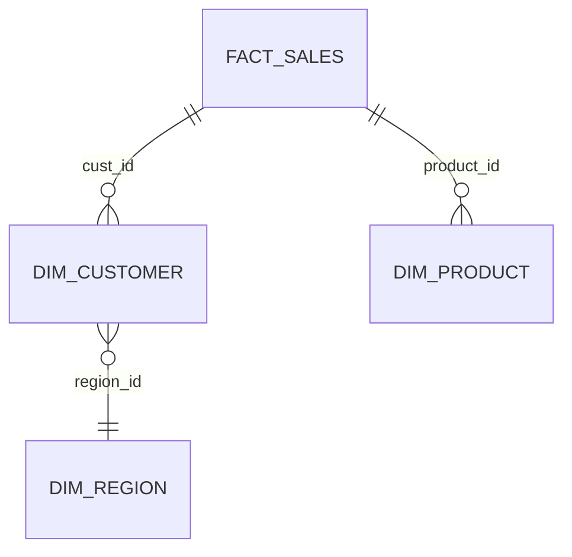
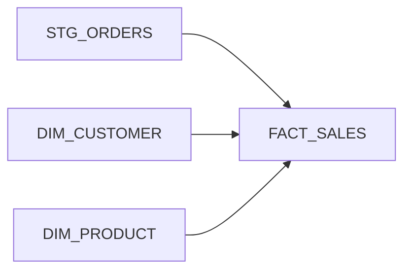

# Data Knowledge Map

Build a **system-level knowledge map** of a database domain through continuous interaction. Output: structured markdown (detail, searchable) and a Mermaid diagram (overview), kept in sync.

## When to use

- "Map the Sales domain", "build knowledge map for Customer data", "document how tables in schema X relate"
- Proactive session to understand a **domain** (schema, subject area), not a one-off analysis task
- When pro-data-analyst is for **task-based analysis**; this skill is for **domain mapping sessions**

## Prerequisites

Workspace should have (same as pro-data-analyst):

- `scripts/`: search_schema, search_documents, check_table, find_relationships, sample_data (see [Scripts Reference](#scripts-reference) for purpose and usage)
- `documents/`: DWH/source metadata Excel if available
- `knowledge/`: existing single-table, multiple-tables, glossary (read/update optional)

## Folder structure

| Path | Purpose |
|------|---------|
| `knowledge/system/` | Index or list of mapped domains (e.g. `index.md`). |
| `knowledge/domains/{domain-slug}/` | One folder per domain (e.g. `sales`, `customer`). |
| `knowledge/domains/{domain-slug}/{system-prefix}_{domain-slug}_domain.md` | Structured markdown: scope, tables, relationships, data flow, links to single-table/multiple-tables. |
| `knowledge/domains/{domain-slug}/{system-prefix}_{domain-slug}_domain.mmd` | Mermaid diagram (ER or flowchart) reflecting the same tables and relationships. |

**System prefix rule:** For every knowledge file this skill creates or updates (`knowledge/domains/`, `knowledge/system/`, `knowledge/single-table/`, `knowledge/multiple-tables/`), the filename must start with a **system prefix** (e.g. database alias or system code such as `DWH`, `CRM`). Use the same alias you pass to scripts (e.g. `--db DWH`) so files from different systems are clearly distinguishable.

**Sync rule:** When tables or relationships change, update both `domain.md` and `domain.mmd` so they stay aligned.

## Scripts Reference

Tools in `scripts/` used during discovery and relationship mapping. Use the same db alias (e.g. `DWH`) as in your workspace; replace `DWH` with your configured alias if different.

| Script | Purpose | Key usage |
|--------|---------|-----------|
| `scripts/search_schema.py` | Search database metadata (table/column names and comments) by keyword. Regex by default; use `\|` for multiple terms. | `python scripts/search_schema.py --keyword "revenue\|order" --db DWH` — optional: `--search-in comments`, `--schema OWNER` |
| `scripts/search_documents.py` | Search Excel metadata (DWH + source tables/columns) in `documents/`. Regex by default. | `python scripts/search_documents.py --keyword "sales\|customer" --folder documents/` |
| `scripts/check_table.py` | Inspect one table: structure, column names, types, and comments. | `python scripts/check_table.py SCHEMA TABLE_NAME --db DWH` |
| `scripts/sample_data.py` | Sample rows from a table; optional profiling for key columns. Prefer **meaningful** data (see [Sampling meaningful data](#sampling-meaningful-data)). | Sample: `python scripts/sample_data.py --schema SCHEMA --table TABLE_NAME --db DWH` — with profiling: add `--profile` — if script supports: order by date/key so rows are representative |
| `scripts/find_relationships.py` | Find FK-like and join paths for one table or a pair of tables. | One table: `python scripts/find_relationships.py --schema SCHEMA --table TABLE --db DWH` — pair: `--tables TABLE1,TABLE2` |

**Optional (not in core workflow):** `scripts/search_glossary.py` — if you need business terms or KPI definitions when scoping the domain: `python scripts/search_glossary.py --keyword "term\|KPI" --folder documents/`.

## Sampling meaningful data

When exploring table data (e.g. via `sample_data` or ad-hoc queries), **do not rely on "first N" or "last N" rows only** — those often are empty, null-heavy, or not representative.

- **Prefer recent, populated rows:** If the table has a date/time or batch column (e.g. `load_date`, `created_at`, `batch_id`, `snapshot_date`), sample by **ordering by that column descending** and taking a small limit (e.g. 10–50 rows), so you see the most recent, usually filled data.
- **If the script does not support ordering:** Extend it with an option (e.g. `--order-by column_name --order-dir DESC`) or run a small ad-hoc query with `ORDER BY <date/key> DESC LIMIT N` and use that to interpret the table; then document in session notes that sampling strategy was "recent by &lt;column&gt;".
- **Avoid:** Blindly taking the first/last N rows without checking for null-heavy or placeholder rows; treat such samples as "may not be representative" and note in the domain doc.

## Verify joins with mini-queries

After `find_relationships` suggests join paths, **verify each candidate relationship** with a real join on a tiny amount of data so the map reflects what actually works.

- **Run a mini verification query** per candidate (table pair + join keys), for example:
  - `SELECT 1 FROM schema.t1 t1 INNER JOIN schema.t2 t2 ON t1.join_key = t2.join_key LIMIT 1;` (adapt to DB dialect).
  - Use **LIMIT 1** or **LIMIT 5** only — never run full joins for verification, to avoid impacting the database.
- **Interpret result:** If the query returns at least one row, mark the relationship as **verified**. If it returns no rows, mark as **unverified** or **no overlapping data in sample** and note in the domain doc (e.g. in Relationships table or Session notes) so future users know the join path was not confirmed.
- **Document in domain.md:** In the Relationships table, add a short note per row (e.g. "verified with mini-query" or "unverified — no rows in sample").

## Workflow (with checkpoints)

Run in order. **Stop at each [MAP CHECKPOINT]** and wait for user confirmation before continuing.

### Step 1: Scope the domain

- **1a.** Ask or infer: domain name (e.g. Sales, Customer), target schema(s), **system prefix** (e.g. `DWH`, `CRM`), and optional keywords (e.g. "revenue", "order").
- **1b.** Create **domain slug** (lowercase, hyphens): e.g. `sales`, `customer-360`. Create folder `knowledge/domains/{domain-slug}/` if it does not exist.
- **1c.** If the domain was mapped before: read `knowledge/domains/{domain-slug}/{system-prefix}_{domain-slug}_domain.md` (and optional `{system-prefix}_{domain-slug}_domain.mmd`) and summarize what is already there. Ask whether to extend, replace, or start fresh.

**[MAP CHECKPOINT 1]** — Confirm scope: domain name, schema(s), and whether to extend existing map or start new.

### Step 2: Discovery (tables and columns)

- **2a.** Search for relevant tables and columns:
  - `python scripts/search_schema.py --keyword "…" --db DWH` (and/or other db aliases)
  - `python scripts/search_documents.py --keyword "…" --folder documents/` if documents exist
- **2b.** Optionally: `check_table`, then **sample meaningful data** for key tables (see [Sampling meaningful data](#sampling-meaningful-data)) to clarify meaning and volume.
- **2c.** Produce a short **candidate table list**: schema.table, brief description, why it belongs to this domain.

**[MAP CHECKPOINT 2]** — Confirm table list: which to include, which to drop, any missing tables (user can name them). Then proceed with the confirmed set only.

### Step 3: Relationships and data flow

- **3a.** For the confirmed tables, find relationships:
  - `python scripts/find_relationships.py --schema SCHEMA --table TABLE --db DWH`
  - For pairs: `--tables TABLE1,TABLE2`
- **3b.** **Verify each candidate join with a mini-query** (see [Verify joins with mini-queries](#verify-joins-with-mini-queries)): run a small SELECT ... JOIN ... LIMIT 1 (or LIMIT 5) to confirm the join returns rows. Mark relationships that fail or return no rows as "unverified" or "no overlapping data in sample".
- **3c.** Summarize: join paths, FK-like links, verification result per path, and (if known) main data flow direction (e.g. source → staging → fact/dim).

**[MAP CHECKPOINT 3]** — Confirm relationships and flow: correct joins, add/remove links, note important filters or caveats.

### Step 4: System view (synthesis)

- **4a.** Draft the **system view** in plain language:
  - Purpose of the domain (what business area it covers).
  - Core tables and their roles (e.g. "FACT_SALES is the main fact; DIM_CUSTOMER, DIM_PRODUCT are dimensions").
  - How they connect (key join keys and relationship types).
  - Main data flow (e.g. "ODI loads from SOURCE_A into STG_* then into FACT/DIM").
  - Links to existing knowledge files: e.g. `single-table/DWH_DWH_FACT_SALES.md`, `multiple-tables/DWH_FACT_SALES_DIM_CUSTOMER.md`.
- **4b.** Present the draft to the user.

**[MAP CHECKPOINT 4]** — Confirm system view text. Adjust wording, add/remove tables or flows until approved.

### Step 5: Write markdown and diagram (and keep in sync)

- **5a.** Write or update `knowledge/domains/{domain-slug}/{system-prefix}_{domain-slug}_domain.md` using the template below. Include links to `knowledge/single-table/` and `knowledge/multiple-tables/` where relevant, keeping their existing `{db}_{schema}_{table}.md` / `{db}_{t1}_{t2}.md` **system-prefixed** naming.
- **5b.** Write or update `knowledge/domains/{domain-slug}/{system-prefix}_{domain-slug}_domain.mmd` with a Mermaid diagram (ER or flowchart) that matches the same tables and relationships. Use consistent node names (e.g. schema.table or short labels keyed in the doc).
- **5c.** Optionally update `knowledge/system/index.md` (or equivalent): add or update a line for this domain with a short description and link to `knowledge/domains/{domain-slug}/{system-prefix}_{domain-slug}_domain.md`.
- **5d.** If the user already has single-table/multiple-tables knowledge files for this domain, add a short "See also" in `domain.md` and do not duplicate long content; link instead.

**[MAP CHECKPOINT 5]** — Present the written paths and a short summary. Ask if the user wants to refine the diagram (e.g. layout, more/fewer tables) or add a new domain in a follow-up session.

## Template: domain.md

```markdown
# Domain: {Domain name}

## Scope
- **Domain:** {name}
- **Schema(s):** {list}
- **Keywords:** {optional}
- **Last updated:** {YYYY-MM-DD}

## Purpose
{Brief: what business area this domain covers and how it is used.}

## Core tables
| Schema.Table | Role | Description |
|--------------|------|-------------|
| ... | Fact / Dimension / Staging / … | ... |

## Relationships
| From | To | Join / relationship | Verified | Notes |
|------|----|---------------------|----------|-------|
| ... | ... | ... | yes / no / unverified | e.g. mini-query returned rows, or no overlapping data |

## Data flow
{Short description: e.g. source → staging → fact/dim, or main ETL/load order.}

## Links to knowledge
- Single-table: `knowledge/single-table/{db}_{schema}_{table}.md` (if exists)
- Multiple-tables: `knowledge/multiple-tables/{db}_{t1}_{t2}.md` (if exists)

## Session notes
- {Date}: {brief note on what was added or changed}
```

## Template: domain.mmd (Mermaid)

Prefer **ER diagram** for table relationships; use **flowchart** if you want to emphasize data flow.

**ER example:**


**Flowchart example (optional):**


Keep table/entity names consistent with `domain.md`. If the diagram grows large, consider splitting by sub-area or documenting the split in `domain.md`.

## Checkpoint rules

- At each **[MAP CHECKPOINT]**, present a short summary and 1–3 clear questions (e.g. "Are these 5 tables correct? Any to add/remove?").
- Do not proceed to the next step until the user confirms or gives corrections.
- If the user corrects (e.g. add table, fix relationship), apply the change and re-present that step’s output before moving on.
- If the user wants to "skip checkpoints", run the workflow end-to-end but still produce the same outputs (domain.md, domain.mmd, optional index); mention in the summary that checkpoints were skipped.

## Integration with pro-data-analyst

- **Before a new analysis task:** pro-data-analyst can consult `knowledge/domains/` and `knowledge/system/` to see which domains exist and how tables relate; then use `single-table/` and `multiple-tables/` for detail.
- **After mapping:** Optionally create or update `knowledge/single-table/` and `knowledge/multiple-tables/` entries for the mapped tables (one file per table or per pair) so future analysis tasks can reuse them. Do not duplicate long content from `domain.md`; keep domain.md as the system view and use single/multiple for per-table/per-pair detail.

## Security (knowledge content)

Same as pro-data-analyst knowledge base: no real data samples, PII, internal hostnames, or credentials in `domain.md` or `domain.mmd`. Use generic placeholders and structural descriptions only.
